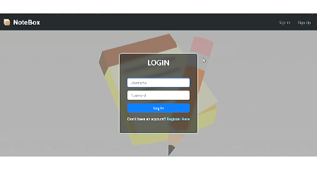
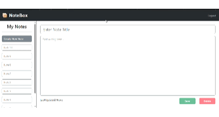
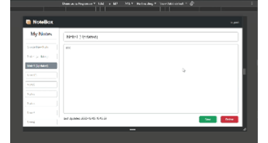

# 📦 NoteBox

#### Video Demo:  [Here is the YouTube Link](https://youtu.be/8GVeq1jwDiw)

## Description:

Hello, my name is Nyan Htet Myat and this is my CS50X final project named "NoteBox", which is a simple note taking web-based application written in python's flask framework.
 
This project solves the problem where people usually write small notes on paper and end up losing them or forgetting where they put them. Physical notes take up space, get messy and are easy to misplace. NoteBox solves this by letting users keep their notes online in one place, organized and easy to access. Users can now easily create, edit and delete notes anytime without worrying about losing them.

## Functionalities:
*   **Register:** Allows new users to create an account with a unique username.
*   **Login:** Lets existing users sign in using their username and password.
*   **Note Management:** Users can create new notes, edit existing notes, and delete notes they no longer need.

## Technologies Used:
These are a list of technologies used for developing NoteBox.
*   Python
*   Flask
*   SQLite3
*   HTML, CSS, JavaScript
*   Bootstrap

## Project Structure:
The below is the Project Folder structure. The **screenshots** subfolder is for demonstrating purposes and not needed to run the project.

<pre>
/NoteBox
    /screenshots
        ...
    /static
        /css
            auth.css
            styles.css
        /images
            note.png
        /js
            scripts.js
    /templates
        index.html
        layout.html
        login.html
        register.html
    app.py
    database.db
    helpers.py
    README.md
    requirements.txt
</pre>

## Setting up the Project:
If you already have Python installed and have cloned this repository, it is recommended to create a virtual environment inside the project folder with this command `python -m venv venv`.  
This will create a new virtual environment inside the project folder.  

To activate it, run:  
`venv\Scripts\activate` (Windows)  
or  
`source venv/bin/activate` (Mac/Linux).

After activating the venv, simply run `pip install -r requirements.txt`. This will install necessary dependencies inside the venv folder.  

Now, enter `flask run` to finally start the NoteBox web application.

## Walkthrough:

### User Authentication

As soon as you enter the web app, the page will direct you to "Login" page. If you have an existing account, you can just enter the username and password to login. If you are a new user, click either "Register Here" or "Sign Up" button at the top and then create a new user account.  
One thing to notice is that individual usernames must be unique here.  
After you are logged in, you will be directed to "Homepage" where you can start creating new notes or edit the existing ones.  
The below is the short gif demonstrating the login function.  

  

### Creating new Notes

Now, we are in index page where we can start creating new notes, simply write something in note title and content and then click "Save" button. A new note will be created and is automatically selected in the left sidebar. You cannot create a note unless you give it a proper title and some contents. You can create as much notes as you want here.  

  

### Editing an old note

To edit a note, simply click an old note, edit something and then click "Save" button. Both the note and the list will be updated accordingly. Here is a GIF demo for editing an old note -  

  

### Deleting a note

To delete a note, just click the note to be deleted and then press "Delete" button. The note will be deleted permently from the database. You cannot delete a note that hasn't been created.

## Other Features:

### Responsiveness

NoteBox works on both large and small screens. Below is a demo GIF showing the layout on different screen sizes. 

### Dynamic Updates

NoteBox updates notes without refreshing the page. Creating, editing, or deleting a note happens instantly using JavaScript async functions.

## Database Schema:

NoteBox uses two tables, one for storing user details and the other for storing notes, named <b>"user"</b> and <b>"notes"</b> accordingly. The below are the database schema used by this project.  

<pre>
CREATE TABLE users (
    id INTEGER PRIMARY KEY AUTOINCREMENT,
    username TEXT NOT NULL UNIQUE,
    password_hash TEXT NOT NULL,
    role TEXT NOT NULL DEFAULT 'user'
);

CREATE TABLE notes (
    id INTEGER PRIMARY KEY AUTOINCREMENT,
    user_id INTEGER NOT NULL,
    title VARCHAR(100) NOT NULL,
    content TEXT,
    created_at TIMESTAMP DEFAULT CURRENT_TIMESTAMP,
    updated_at TIMESTAMP DEFAULT CURRENT_TIMESTAMP,
    FOREIGN KEY (user_id) REFERENCES users(id)
);
</pre>  

After the table creations, if you noticed, there is <b>"updated_at"</b> attribute in <b>"notes"</b> table. To avoid manually updating the timestamp each time the user edits a note, I have created a trigger which will automatically update the timestamp as below -  

<pre>
CREATE TRIGGER update_notes_updated_at
BEFORE UPDATE ON notes
FOR EACH ROW
BEGIN
    UPDATE notes SET updated_at = CURRENT_TIMESTAMP WHERE id = OLD.id;
END;
</pre>

## My Challenges:

### UI Design

One challenge I faced early on was designing a user-friendly interface. I had to draw the GUI several times on paper by hand again and again, keeping it between not too complex and not too plain.

### Implementing

To build the frontend, I had decided to go with <b>Bootstrap</b>. But since, I was not familiar with it, I had to follow a tutorial at <a href="https://www.w3schools.com/bootstrap5/">w3schools.com</a>
 
After that, I was able to build a basic and clean layout for <b>NoteBox</b>. However, it still didn’t have any dynamic behavior. So, I had to turn to <b>JavaScript</b>, which was also quite unfamiliar to me. 
 
What I wanted to do is to make the web page updates dynamically. For example, refreshing the whole page every time a user edits a note would be annoying. Editing a note multiple times would mean multiple refreshes, which is not practical. After reviewing JavaScript examples from CS50, I was able to get the dynamic updates working. (There may still be areas to improve.)

## Acknowledgements:

I also thank the CS50 staff for their lectures and materials, which helped guide me through this project. Here is the <a href="https://cs50.harvard.edu/x/">Link to CS50x</a>. I would also like to thank the Flask, Bootstrap and W3Schools communities for their documentation and resources, which helped in building this project. This work was completed as part of the CS50x course.

